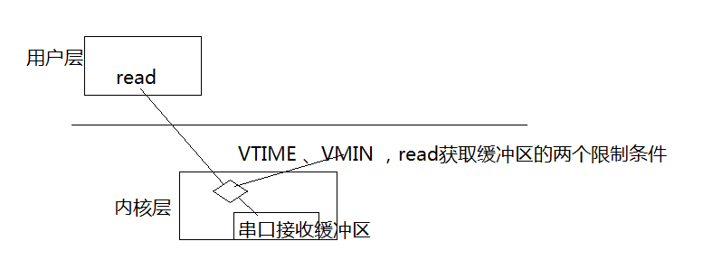

# 串口demo

## linux编程参考
* [编程使用参考](https://mp.csdn.net/postedit/78976286)
* [串口VMIN VTIME 详解](https://blog.csdn.net/zcabcd123/article/details/7595970)

## 测试心得

```sh
假设上层以阻塞的方式操作串口,关键操作如下:
read_len = 255
newtio.c_cc[VTIME]  = 1
newtio.c_cc[VMIN] = 255
nread = read(fd1, buf1, read_len)
```
<div>下面对 VMIN 和VTIME以及read_len的几种组合使用做说明:</div>

```sh
VMIN：串口内核区域缓冲区字节数的一个判断值。忽略VTIME的情况下，只有当内核缓冲区的数据大小满足VMIN时，内核才会读取内核缓冲区的数据给read函数。
VTIME：内核缓冲区接收数据的超时值，当内核缓冲区的数据字节数 < VMIN时，VTIME才有起作用，当VTIME达到超时值，内核会将内核缓冲区的数据交给read函数。
read_len：read函数要求读取的数据的大小。
```
<div>使用总结:</div>

```sh
  VTIME和VMIN是内核读取串口内核缓冲区的两个限制条件（判断条件）。
```




<div>测试:</div>

```sh
1.轮寻效果
  测试条件：
    VTIME = 0
    VMIN = 0
  测试结果：
    read函数操作内核缓冲区无限制，此时相当于轮寻去读(read_len无作用)


2.阻塞效果
测试条件：
  VTIME = 0
  VMIN = n
测试结果：
  read函数操作内核缓冲区有VMIN的限制（此时是阻塞去读），只有内核缓冲区的数据大小 >= VMIN时，read函数才会操作内核缓冲区，获取缓冲区的数据。
    如果read_len >= 内核缓冲区的数据大小，则read函数的返回值是读取的数据的大小
    如果read_len <   内核缓冲区的数据大小，则read函数的返回值是read_len

3.阻塞效果
测试条件：
  VTIME = n
  VMIN = n
测试结果：
  read函数操作内核缓冲区有VMIN的限制和VTIME的限制。
    3.1. 内核缓冲区的数据大小 >= VMIN时（此时VTIME无效），read函数才会操作内核缓冲区，获取缓冲区的数据。
      如果read_len >= 内核缓冲区的数据大小，则read函数的返回值是读取的数据的大小
      如果read_len <   内核缓冲区的数据大小，则read函数的返回值是read_len
    3.2. 内核缓冲区的数据大小 < VMIN时（此时VTIME有效），只有当VTIME触发超时，read函数才会操作内核缓冲区，获取缓冲区的数据。
    如果read_len >= 内核缓冲区的数据大小，则read函数的返回值是读取的数据的大小
    如果read_len <   内核缓冲区的数据大小，则read函数的返回值是read_len
```

串口demo使用

```sh
串口demo的使用：
  使用make编译
  打开串口：./uart_test /dev/ttyO1

测试：
  在同一个开发板上测试
  1. 打开两个终端
  2. 在终端1运行
  ./uart_test /dev/ttyO1
  3. 在终端2运行
  stty -F /dev/tty speed  115200 cs8 -parenb -cstopb
  echo "dsafkljekllsdsafedsafekdddddddddddoasjkldfjeias" > /dev/ttyO2
  4. 在终端1上看看有没有收到数据，收到数据说明demo OK
```
